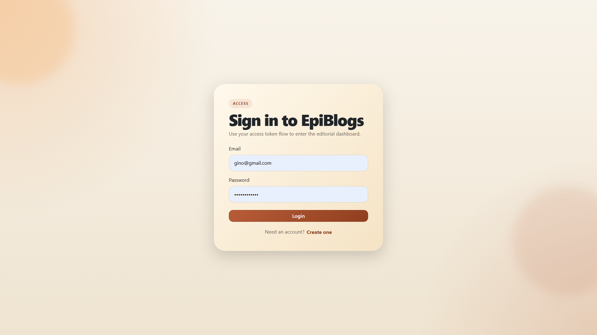
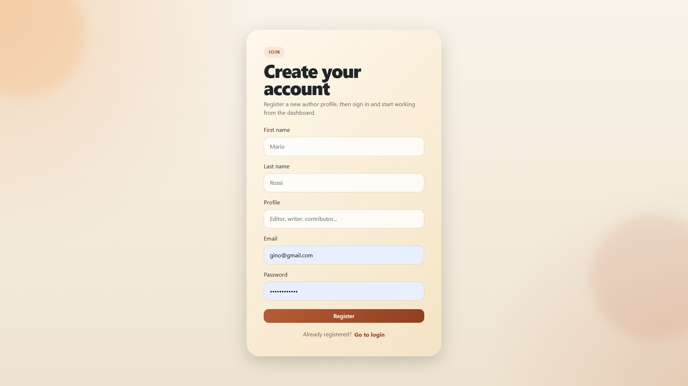
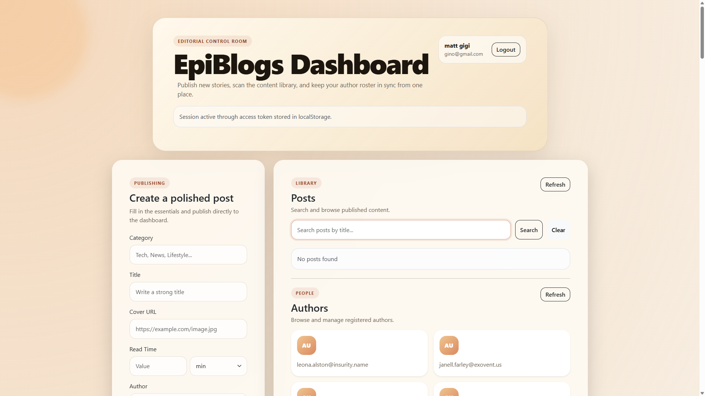
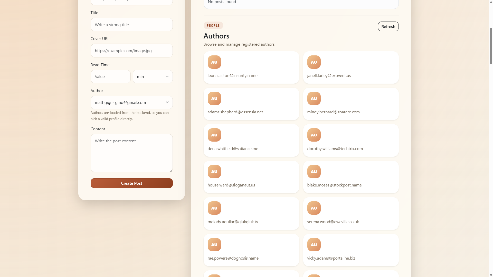

# EpiBlogs

[](https://react.dev/)
[](https://vitejs.dev/)
[](https://expressjs.com/)
[](https://www.mongodb.com/)
[](https://mongoosejs.com/)
[](https://jwt.io/)
[](https://vitest.dev/)
[](https://www.postman.com/)

Full stack editorial dashboard built with a modular Node.js/Express backend and a React frontend. The project includes JWT authentication, Google OAuth login, protected API routes, author and post management, automated tests, and a Postman collection aligned with the current API.

## Quick Links

- [Screenshots](#screenshots)
- [Tech Links](#tech-links)
- [Project Structure](#project-structure)
- [API Collection](#api-collection)
- [Italiano](#italiano)
- [English](#english)

## Screenshots

### Login


### Register


### Dashboard


### Authors


## Tech Links

- [React](https://react.dev/)
- [Vite](https://vitejs.dev/)
- [Express](https://expressjs.com/)
- [MongoDB](https://www.mongodb.com/)
- [Mongoose](https://mongoosejs.com/)
- [JWT](https://jwt.io/)
- [Vitest](https://vitest.dev/)
- [Supertest](https://github.com/ladjs/supertest)
- [Postman](https://www.postman.com/)
- [Cloudinary](https://cloudinary.com/)
- [Nodemailer](https://nodemailer.com/)

## Project Structure

```text
EpiBlogs/
|- backend/
|  |- app.js
|  |- server.js
|  |- middlewares/
|  |- models/
|  |- routes/
|  |  |- auth/
|  |  |- authors/
|  |  |- posts/
|  |- utils/
|  |- postman/
|- frontend/
|  |- src/
|  |  |- assets/
|  |  |- hooks/
|- test/
|  |- backend/
|  |- frontend/
|- docs/
|  |- screenshots/
|- package.json
```

## API Collection

Postman collection:

- [backend/postman/EpiBlogs.postman_collection.json](backend/postman/EpiBlogs.postman_collection.json)

La collection e aggiornata con:

- register/login JWT
- `GET /me`
- bootstrap Google OAuth e `POST /auth/google/exchange-code`
- CRUD authors, posts, comments
- upload avatar e cover
- salvataggio automatico di `accessToken`, `authorId`, `postId` e `commentId` nelle collection variables

## Italiano

### Panoramica

EpiBlogs e una dashboard editoriale full stack sviluppata per gestire:

- autenticazione JWT
- login con Google OAuth 2.0
- registrazione e login utenti
- recupero utente autenticato con `/me`
- CRUD autori
- CRUD post
- CRUD commenti
- upload immagini con Cloudinary
- invio email con Nodemailer / SendGrid

Il progetto e stato rifattorizzato con una struttura modulare sia nel backend sia nei test, mantenendo stabile il comportamento applicativo.

### Stack Tecnologico

- Frontend: React, Vite, React Bootstrap
- Backend: Node.js, Express, MongoDB, Mongoose
- Auth e sicurezza: JWT, bcrypt, Passport, Google OAuth 2.0
- Integrazioni: Cloudinary, Nodemailer
- Testing: Vitest, Supertest, jsdom
- Tooling: ESLint, Postman

### Funzionalita Principali

- Tutti gli endpoint protetti richiedono `Authorization: Bearer <token>`.
- `POST /login` restituisce il token di accesso.
- `POST /authors` e `POST /register` permettono la creazione di un account locale.
- `GET /auth/google` avvia il login Google e la callback backend restituisce al frontend un codice monouso per recuperare il JWT applicativo.
- `POST /auth/google/exchange-code` scambia quel codice con il payload finale `{ token, author }`.
- `GET /me` restituisce l'utente collegato al token.
- Il frontend salva il token in `localStorage` e ripristina la sessione al refresh.
- Il login classico e il login Google convergono sullo stesso standard JWT usato da tutto il backend.
- Il JWT non passa nella query string OAuth: il frontend scambia un codice monouso a breve scadenza con il backend.
- Se il token non e piu valido, il frontend forza il logout automaticamente.
- Gli update e delete di authors, posts e comments seguono ownership: un utente autenticato puo modificare solo le proprie risorse.
- Il login classico e l'exchange Google sono protetti da rate limiting.
- La collection Postman e allineata al progetto attuale.
- La suite test copre backend e frontend con file separati in `test/backend` e `test/frontend`.

### Avvio Locale

#### Installazione

```bash
npm install
npm --prefix backend install
npm --prefix frontend install
```

#### Variabili ambiente

Configura `backend/.env` con almeno:

- `PORT`
- `MONGODB_CONNECTION_URI`
- `JWT_SECRET_KEY`
- `FRONTEND_URL`
- `GOOGLE_CLIENT_ID`
- `GOOGLE_CLIENT_SECRET`
- `GOOGLE_CALLBACK_URL`
- `MAIL_HOST`
- `MAIL_PORT`
- `MAIL_USER`
- `MAIL_PASSWORD`
- `MAIL_FROM`
- `SENDGRID_API_KEY`
- `CLOUDINARY_CLOUD_NAME`
- `CLOUDINARY_API_KEY`
- `CLOUDINARY_API_SECRET`

Variabili opzionali utili in deploy:

- `CORS_ALLOWED_ORIGINS`
- `CORS_ALLOW_CREDENTIALS`
- `TRUST_PROXY`
- `OAUTH_COOKIE_DOMAIN`
- `OAUTH_COOKIE_SAME_SITE`

Se il frontend non gira su `http://localhost:5173` oppure il backend non gira su `http://localhost:3000`, configura anche `frontend/.env` con:

- `VITE_API_BASE_URL=http://localhost:3000`

#### Avvio backend

```bash
npm run dev
```

#### Avvio frontend

```bash
npm --prefix frontend run dev
```

#### Script root utili

```bash
npm run dev:backend
npm run dev:frontend
npm run check
npm run lint
npm run build
npm run verify
```

### Test e Qualita

```bash
npm test
npm run test:backend
npm run test:frontend
npm --prefix frontend run lint
npm --prefix frontend run build
```

### Note Postman

- Esegui prima `Register Author` oppure `Login`: la collection salva automaticamente `accessToken` e `authorId`.
- `Create Post` salva `postId`, `Create Comment` salva `commentId`.
- `Start Google OAuth` apre il flusso lato browser; per testare `Exchange Google Auth Code` in Postman devi copiare manualmente il `code` ricevuto dal redirect frontend.
- Le request di update/delete ownership-based devono usare lo stesso utente che ha creato la risorsa.

### Endpoints Principali

- `POST /login`
- `POST /authors`
- `GET /auth/google`
- `GET /auth/google/callback`
- `POST /auth/google/exchange-code`
- `GET /me`
- `GET /api/v1/authors`
- `PATCH /api/v1/authors/:authorId/avatar`
- `POST /api/v1/posts`
- `PATCH /api/v1/posts/:postId/cover`
- `GET /api/v1/posts/:postId/comments`

### Portfolio Value

Questo repository mostra competenze su:

- progettazione REST API protette
- modularizzazione backend Express
- integrazione reale frontend/backend
- session management lato client
- testing multi-layer
- pulizia strutturale del repository

---

## English

### Overview

EpiBlogs is a full stack editorial dashboard built to manage:

- JWT authentication
- Google OAuth 2.0 login
- user registration and login
- authenticated user retrieval through `/me`
- author CRUD operations
- post CRUD operations
- comment CRUD operations
- image uploads through Cloudinary
- email notifications with Nodemailer / SendGrid

The project was refactored into a cleaner, more modular structure across backend and testing layers while keeping the existing behavior stable.

### Tech Stack

- Frontend: React, Vite, React Bootstrap
- Backend: Node.js, Express, MongoDB, Mongoose
- Auth and security: JWT, bcrypt, Passport, Google OAuth 2.0
- Integrations: Cloudinary, Nodemailer
- Testing: Vitest, Supertest, jsdom
- Tooling: ESLint, Postman

### Core Features

- All protected endpoints require `Authorization: Bearer <token>`.
- `POST /login` returns the access token.
- `POST /authors` and `POST /register` create a local account.
- `GET /auth/google` starts the Google OAuth flow and the backend callback returns a one-time code that the frontend exchanges for the app JWT.
- `POST /auth/google/exchange-code` exchanges that code for the final `{ token, author }` payload.
- `GET /me` returns the authenticated user linked to the token.
- The frontend stores the token in `localStorage` and restores the session on refresh.
- Standard email/password login and Google login now share the same JWT-based session flow.
- The JWT is no longer exposed in the OAuth redirect URL because the frontend exchanges a short-lived one-time code with the backend.
- Invalid tokens trigger an automatic logout on the client.
- Author, post, and comment updates/deletes are ownership-based, so authenticated users can mutate only their own resources.
- Classic login and Google exchange are protected by rate limiting.
- The Postman collection is aligned with the current API.
- The automated suite covers both backend and frontend in `test/backend` and `test/frontend`.

### Local Setup

#### Install

```bash
npm install
npm --prefix backend install
npm --prefix frontend install
```

#### Environment Variables

Configure `backend/.env` with at least:

- `PORT`
- `MONGODB_CONNECTION_URI`
- `JWT_SECRET_KEY`
- `FRONTEND_URL`
- `GOOGLE_CLIENT_ID`
- `GOOGLE_CLIENT_SECRET`
- `GOOGLE_CALLBACK_URL`
- `MAIL_HOST`
- `MAIL_PORT`
- `MAIL_USER`
- `MAIL_PASSWORD`
- `MAIL_FROM`
- `SENDGRID_API_KEY`
- `CLOUDINARY_CLOUD_NAME`
- `CLOUDINARY_API_KEY`
- `CLOUDINARY_API_SECRET`

Helpful optional deploy variables:

- `CORS_ALLOWED_ORIGINS`
- `CORS_ALLOW_CREDENTIALS`
- `TRUST_PROXY`
- `OAUTH_COOKIE_DOMAIN`
- `OAUTH_COOKIE_SAME_SITE`

If the frontend is not running on `http://localhost:5173` or the backend is not running on `http://localhost:3000`, also configure `frontend/.env` with:

- `VITE_API_BASE_URL=http://localhost:3000`

#### Start Backend

```bash
npm run dev
```

#### Start Frontend

```bash
npm --prefix frontend run dev
```

#### Helpful root scripts

```bash
npm run dev:backend
npm run dev:frontend
npm run check
npm run lint
npm run build
npm run verify
```

### Testing and Quality

```bash
npm test
npm run test:backend
npm run test:frontend
npm --prefix frontend run lint
npm --prefix frontend run build
```

### Postman Notes

- Run `Register Author` or `Login` first: the collection automatically stores `accessToken` and `authorId`.
- `Create Post` stores `postId`, and `Create Comment` stores `commentId`.
- `Start Google OAuth` begins the browser-based flow; to test `Exchange Google Auth Code` in Postman you need to manually copy the `code` returned to the frontend callback URL.
- Ownership-protected update/delete requests must be executed with the same authenticated user that created the resource.

### Main Endpoints

- `POST /login`
- `POST /authors`
- `GET /auth/google`
- `GET /auth/google/callback`
- `POST /auth/google/exchange-code`
- `GET /me`
- `GET /api/v1/authors`
- `PATCH /api/v1/authors/:authorId/avatar`
- `POST /api/v1/posts`
- `PATCH /api/v1/posts/:postId/cover`
- `GET /api/v1/posts/:postId/comments`

### Portfolio Value

This repository highlights practical skills in:

- protected REST API design
- Express backend modularization
- real frontend/backend integration
- client-side session management
- multi-layer automated testing
- repository cleanup and maintainability work
