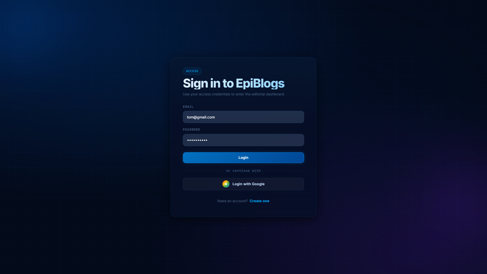
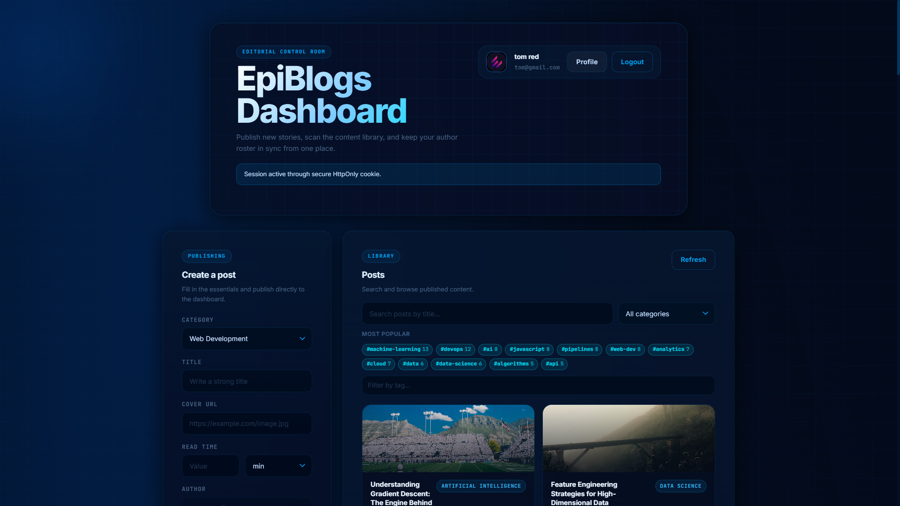
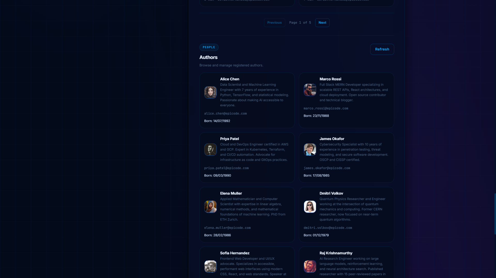
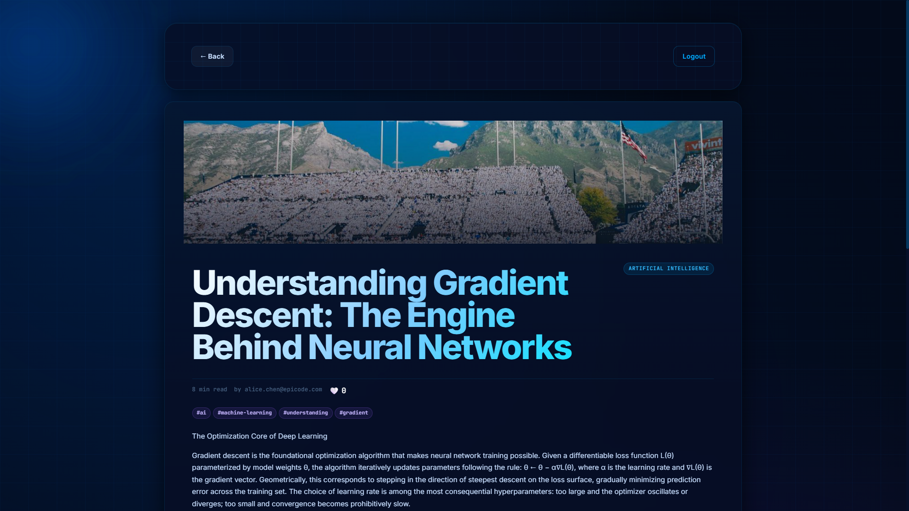
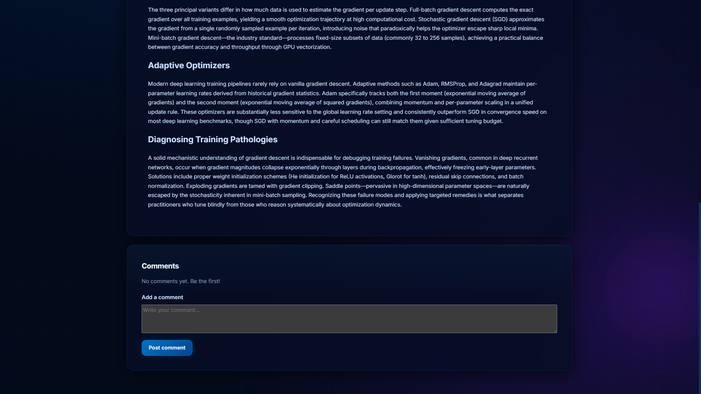
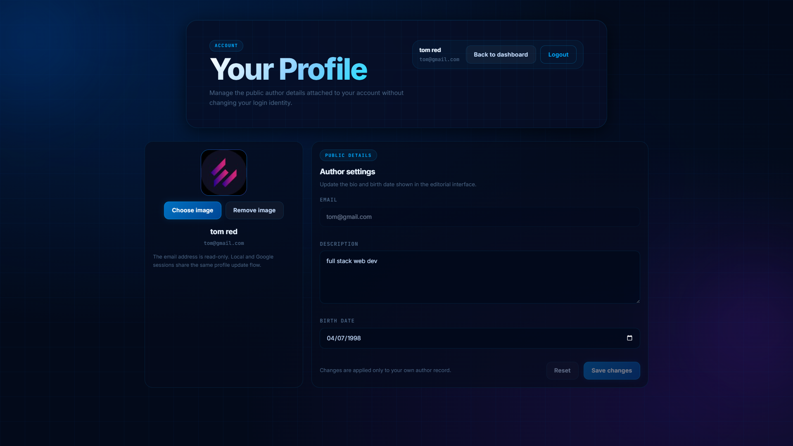

# EpiBlogs

Full-stack MERN blogging platform built as a portfolio project focused on production-style backend architecture, auth security, API design, and modern React UX.

This repository is a monorepo with:

- backend: Express 5 + MongoDB (Mongoose) API
- frontend: React 19 + Vite client
- test: backend and frontend Vitest suites
- seed/scripts: data maintenance and normalization utilities

## Tech Badges


## Italiano

### Panoramica

EpiBlogs e una piattaforma blogging full-stack con backend Express/MongoDB e frontend React/Vite. Il progetto dimostra competenze pratiche su autenticazione sicura, API REST versionate, ownership checks lato server, upload media su Cloudinary e testing automatico.

### Funzionalita principali

- Autenticazione cookie-first con cookie HttpOnly.
- Login locale + Google OAuth con code exchange.
- CRUD completo per authors, posts, comments.
- Likes sui post con endpoint dedicati.
- Upload avatar e cover con Cloudinary.
- Ricerca post, filtro category/tag e lista tag aggregata.
- CORS e Helmet configurati per ambienti reali (dev/prod).

### Note tecniche specifiche

- API versionata su /api/v1.
- Health check dedicato su /health.
- Cookie di sessione auth: epiblogs.accessToken (HttpOnly, maxAge 1h).
- Google code exchange con codice monouso TTL 60 secondi.
- Backend body limit JSON: 100kb.
- Server port default: 3000.

### Competenze dimostrate

- Progettazione API REST versionata (/api/v1).
- Sicurezza applicativa (auth middleware, ownership enforcement, rate limits).
- Data modeling MongoDB/Mongoose.
- Gestione stato frontend e UX orientata al prodotto.
- Test backend/frontend con Vitest.
- Coerenza documentazione tecnica (README + Postman).

## English

### Overview

EpiBlogs is a full-stack blogging platform designed as a job-ready portfolio project. It focuses on production-minded backend architecture, secure auth flows, structured API design, and maintainable frontend patterns.

### Key Features

- Cookie-first authentication with HttpOnly session cookies.
- Local login + Google OAuth one-time code exchange.
- Full CRUD for authors, posts, and comments.
- Post likes endpoints (read + toggle).
- Cloudinary media upload for avatars and covers.
- Post search, category/tag filtering, aggregated tag endpoint.
- CORS and Helmet hardening for real deployment scenarios.

### Engineering Highlights

- Versioned REST API under /api/v1.
- Server-side authorization and ownership checks.
- Clear backend/frontend domain separation.
- Automated test coverage with Vitest.
- API collection aligned with runtime behavior (Postman).

### Concrete Runtime Details

- Auth cookie name: epiblogs.accessToken.
- Auth cookie max age: 60 minutes.
- One-time Google auth exchange code TTL: 60 seconds.
- Default backend port: 3000.
- CSP and CORS are configured for local and production environments.

## Screenshots

### Core Views








## Repository Layout

- backend/app.js: Express app setup (CORS, Helmet, auth middleware, routers)
- backend/server.js: DB connection + HTTP bootstrap + graceful shutdown
- backend/routes: domain routers and handlers
- backend/models: Mongoose models (authors, posts, categories, auth code, blacklist, rate limit)
- backend/middlewares: authentication, upload, rate limit, mail
- frontend/src: pages, components, hooks, API client
- test/backend: API and backend domain tests
- test/frontend: UI/component/API tests
- backend/postman: Postman collection

## Architecture and API

- API base: /api/v1
- Health endpoint: GET /health
- Main route groups:
  - /api/v1/auth
  - /api/v1/authors
  - /api/v1/categories
  - /api/v1/posts

Core auth endpoints:

- POST /api/v1/auth/register
- POST /api/v1/auth/login
- POST /api/v1/auth/logout
- GET /api/v1/auth/me
- GET /api/v1/auth/google
- GET /api/v1/auth/google/callback
- POST /api/v1/auth/google/exchange-code

Posts and comments endpoints (selected):

- GET /api/v1/posts
- GET /api/v1/posts/:postId
- POST /api/v1/posts
- PATCH /api/v1/posts/:postId/cover
- GET /api/v1/posts/:postId/likes
- POST /api/v1/posts/:postId/likes
- GET /api/v1/posts/:postId/comments
- POST /api/v1/posts/:postId/comments

Authors endpoints (selected):

- GET /api/v1/authors
- GET /api/v1/authors/:authorId
- PUT /api/v1/authors/:authorId
- PATCH /api/v1/authors/:authorId/avatar

## Local Setup

Install dependencies:

```bash
npm install
npm --prefix backend install
npm --prefix frontend install
```

Run backend and frontend (two terminals):

```bash
npm run dev:backend
npm run dev:frontend
```

Alternative shortcuts:

```bash
npm run dev
```

Starts backend only (root shortcut):

```bash
npm start
```

Expected local URLs:

- frontend: http://localhost:5173
- backend: http://localhost:3000

Run checks:

```bash
npm run check
npx vitest --run
```

Full CI-style verification:

```bash
npm run verify
```

This runs tests + backend syntax check + frontend lint + frontend build.

## Environment Variables

Use these templates:

- backend/.env.example
- frontend/.env.example

Backend required:

- MONGODB_CONNECTION_URI
- JWT_SECRET_KEY

Backend commonly configured:

- NODE_ENV
- PORT
- DEVELOPMENT_FRONTEND_URL
- DEPLOYMENT_FRONTEND_URL
- CORS_ALLOWED_ORIGINS
- CORS_ALLOW_CREDENTIALS
- CORS_ALLOW_VERCEL_PREVIEWS
- TRUST_PROXY
- AUTH_COOKIE_SECURE
- AUTH_COOKIE_SAME_SITE
- GOOGLE_CLIENT_ID
- GOOGLE_CLIENT_SECRET
- DEVELOPMENT_GOOGLE_CALLBACK_URL
- DEPLOYMENT_GOOGLE_CALLBACK_URL
- CLOUDINARY_CLOUD_NAME
- CLOUDINARY_API_KEY
- CLOUDINARY_API_SECRET

Frontend public vars:

- VITE_API_URL_DEVELOPMENT
- VITE_API_URL_PRODUCTION
- Optional fallback: VITE_API_URL

Recommended local setup:

- Copy backend/.env.example to backend/.env
- Copy frontend/.env.example to frontend/.env
- Keep VITE_API_URL_DEVELOPMENT=http://localhost:3000

## Testing and QA

- Backend + frontend tests via Vitest.
- Focused suites for auth, routing, handlers, domain components.
- Postman collection for manual API validation:
  - backend/postman/EpiBlogs.postman_collection.json

Useful test commands:

```bash
npm run test
npm run test:backend
npm run test:frontend
npm run test:watch
```

## Project Utilities

- Seed sync script:
  - backend/scripts/syncSeedToMongo.js

Backend seed and maintenance scripts:

```bash
npm --prefix backend run seed:categories
npm --prefix backend run seed:sync-mongo
npm --prefix backend run seed:fix-posts
npm --prefix backend run seed:fix-category-slugs
npm --prefix backend run seed:all
```

It upserts data from seed/authors.json and seed/posts.json with normalization rules.

## Security Notes

- HttpOnly auth cookie.
- Server-side ownership enforcement.
- Rate limiting on sensitive auth endpoints.
- Helmet + CORS protection.
- Sensitive author fields removed from serialized output.

## Troubleshooting

- If node server.js fails from repository root, run backend from backend folder or use npm run dev:backend from root.
- If frontend cannot call API, verify VITE_API_URL_DEVELOPMENT in frontend/.env and backend CORS env values.
- If uploads fail, verify Cloudinary env variables and ensure multipart/form-data requests are used.
- If Google login fails locally, verify DEVELOPMENT_GOOGLE_CALLBACK_URL and Google OAuth console redirect URL.
